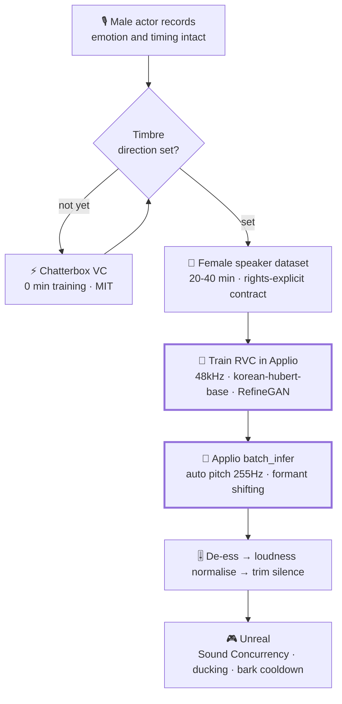

<div align="center">

<h1>KawaiiVoice</h1>

**Turning a 30-year-old man's performance into a high-school-girl character voice.**<br>
Korean dubbing pipeline research for an Unreal Engine top-down shooter<br><br>

[](../LICENSE)
[](https://github.com/Chang-Jin-Lee/KawaiiVoice/stargazers)
[](https://www.unrealengine.com)

[**📊 Research Report**](./01-research-report.md)
•
[**⚙️ Pipeline**](./02-production-pipeline.md)
•
[**🎙️ Voice Direction**](./03-voice-direction.md)
•
[**⚖️ Licensing**](./04-licensing.md)
•
[**🎮 Unreal**](./05-unreal-integration.md)

[**한국어**](../README.md) | **English**

</div>

---

> [!NOTE]
> This repository is not a runnable tool — it documents **verified reasoning behind a technology choice**.
> Every star count, license, and archive status was queried directly from the GitHub API; license terms and
> inference parameters were read from actual shallow clones. Survey date: **2026-07-30**.
>
> The detailed documents are written in Korean. This page is a full summary of the findings.

## Conclusions

| Purpose | Choice | License | Reason |
|---|---|---|---|
| **Production dubbing** | [**Applio**](https://github.com/IAHispano/Applio) | MIT | `korean-hubert-base` embedder · formant shifting · per-clip auto pitch |
| **Zero-training test today** | [**Chatterbox**](https://github.com/resemble-ai/chatterbox) `ChatterboxVC` | MIT (code + weights) | No training needed; safest license for commercial release |
| **Live monitoring while recording** | [**w-okada VCClient**](https://github.com/w-okada/voice-changer) | MIT | Actor hears the converted result and adjusts performance |
| **When re-synthesising lines is acceptable** | [**GPT-SoVITS**](https://github.com/RVC-Boss/GPT-SoVITS) | MIT | 60k★, Korean support, most active repo in the space |

### Why RVC is the axis

| Family | Input | Preserves the actor's take | Verdict |
|---|---|---|---|
| **RVC (Applio)** | audio | **High** — F0 contour explicitly extracted and shifted | ✅ **Production** |
| Chatterbox VC | audio | Medium — routed through semantic tokens, some prosody lost | ⚠️ Prototyping |
| TTS (GPT-SoVITS, IndexTTS2, CosyVoice) | **text** | **None** — lines are generated anew | Alternative path |

The whole point of hiring a voice actor is **to use that take**. TTS regenerates from text, which defeats the purpose. This matters even more for a top-down shooter, where short combat barks ("Behind you!", "Reloading!") are gameplay feedback and their timing carries information.

## Key findings

<details open>
<summary><b>1. The reason to pick Applio is not its GUI</b></summary><br>

Reading `core.py` revealed three features vanilla RVC lacks, each aimed squarely at this project's problem.

- **`--embedder_model korean-hubert-base`** — decisive for a Korean-language game. Vanilla RVC only offers the English-centric `contentvec`. **The default *is* `contentvec`, so this must be set explicitly.**
- **Formant shifting** (`--formant_shifting/qfrency/timbre`) — much of perceived gender comes from vocal-tract length (formant positions), not F0. Raising pitch alone yields a "sped-up man".
- **Per-clip automatic pitch** — see finding 3.
</details>

<details open>
<summary><b>2. Chatterbox replaces Seed-VC — under MIT</b></summary><br>

`src/chatterbox/vc.py` contains an actual voice-conversion class, separate from the TTS path:

```python
class ChatterboxVC:
    def set_target_voice(self, wav_fpath): ...
    def generate(self, audio, target_voice_path=None): ...
```

Both **code and weights are MIT**, making it the safest option for a commercial game. Three constraints found in the source: a Perth neural watermark is applied to **every** output, only the **first 10 seconds** of the reference are used (`DEC_COND_LEN = 10 * S3GEN_SR`), and because it routes through S3 *semantic* tokens it **preserves performance less faithfully than RVC**.
</details>

<details open>
<summary><b>3. A fixed pitch offset is dangerous for batch work</b></summary><br>

An actor's median pitch varies per take (a shout versus a whisper can differ by an octave). A fixed +12 over-corrects on shouted lines. From `rvc/infer/pipeline.py`:

```python
limit = 12
up_key = clamp(round(12 * np.log2(proposed_pitch_threshold / median_f0)), ±limit)
f0 *= pow(2, (pitch + up_key) / 12)
```

**Three traps, all verified in source:**
1. `--pitch` is **summed** with the computed value — passing `+12` alongside auto-pitch double-shifts by an octave
2. `--proposed_pitch_threshold` **defaults to 155.0 (male)** — female targets need an explicit `255`
3. `--proposed_pitch` alone uses `type=bool`, so **passing `False` turns it on** (`bool("False") == True`)
</details>

<details open>
<summary><b>4. ⚠️ fish-speech forbids commercial use</b></summary><br>

Several "best open-source dubbing models of 2026" articles still rank it first, but the LICENSE text (**updated 2026-03-07**) is the `FISH AUDIO RESEARCH LICENSE`:

> "Any Commercial use of the Materials **requires a separate license** from Fish Audio."
> Commercial Purpose includes *"any use in connection with a product or service for which You charge a fee or generate revenue, **whether directly or indirectly**"*

That covers ads and in-app purchases, not just paid games. GitHub's badge only reads `NOASSERTION`, so **read the LICENSE text rather than trusting the badge.**
</details>

<details>
<summary><b>5. Seed-VC is archived / Applio is in maintenance mode</b></summary><br>

- `Plachtaa/seed-vc` — **archived**, last push 2025-04-20. Its author archived nearly every repo (`VALL-E-X`, `VITS-fast-fine-tuning`, `FAcodec`), and no maintained realtime fork exists.
- `IAHispano/Applio` — from its own README: *"Applio will no longer receive frequent updates ... focus mainly on security patches."* The stated reason is that the project is **already stable and mature**, and every feature this project needs is present, so it remains the right production choice.
</details>

## Verification table (excerpt)

`ARCH` = archived on GitHub. Full table in the [research report](./01-research-report.md).

| Repository | ★ | License | ARCH | Last push | Type |
|---|---:|---|:---:|---|---|
| [GPT-SoVITS](https://github.com/RVC-Boss/GPT-SoVITS) | 60,209 | MIT | | 2026-07-22 | TTS/cloning |
| [VibeVoice](https://github.com/microsoft/VibeVoice) | 51,246 | MIT | | 2026-07-24 | TTS (long-form) |
| [OpenVoice](https://github.com/myshell-ai/OpenVoice) | 37,048 | MIT | | 2025-04-19 | Tone conversion |
| [**RVC-WebUI**](https://github.com/RVC-Project/Retrieval-based-Voice-Conversion-WebUI) | **36,802** | **MIT** | | 2026-07-23 | **VC** |
| [fish-speech](https://github.com/fishaudio/fish-speech) | 31,633 | **non-commercial** | | 2026-07-26 | TTS |
| [so-vits-svc](https://github.com/svc-develop-team/so-vits-svc) | 28,152 | AGPL-3.0 | **YES** | 2023-11-11 | SVC |
| [**Chatterbox**](https://github.com/resemble-ai/chatterbox) | **25,763** | **MIT** | | 2026-07-21 | **VC + TTS** |
| [CosyVoice](https://github.com/FunAudioLLM/CosyVoice) | 22,483 | Apache-2.0 | | 2026-05-25 | TTS |
| [IndexTTS2](https://github.com/index-tts/index-tts) | 22,256 | bilibili custom | | 2026-07-14 | TTS (emotion) |
| [**VCClient**](https://github.com/w-okada/voice-changer) | **20,694** | **MIT** | | 2026-03-21 | **Realtime VC** |
| [**Applio**](https://github.com/IAHispano/Applio) | **3,531** | **MIT** | | 2026-07-29 | **RVC frontend** |
| [seed-vc](https://github.com/Plachtaa/seed-vc) | 3,893 | GPL-3.0 | **YES** | 2025-04-20 | Zero-shot VC |

## Getting started

```bash
gh auth login
./scripts/audit_repos.sh      # re-verify stars / license / archived / last push
./scripts/fetch_repos.sh      # shallow-clone the studied repos into external/ (~330MB)

APPLIO_DIR=/path/to/Applio \
  ./scripts/convert_batch.sh ./raw/male_takes ./out/kawaii kawaii_v1
```

> [!IMPORTANT]
> If an SPDX badge reads `NOASSERTION`, **read the LICENSE text.** fish-speech is the cautionary example.

## Pipeline



The three lines that matter:

```bash
--embedder_model korean-hubert-base       # Korean phoneme preservation
--proposed_pitch True --threshold 255     # per-clip automatic pitch
--formant_shifting True                   # perceived-gender correction
```

## ⚠️ Voice rights notice

> [!CAUTION]
> **A software license and voice-data rights are entirely separate matters.**
> Applio being MIT means you may use the *tool* freely — not that you may train on *any* voice.

**Do not**

- ❌ Use **"anime character / voice actor RVC models"** distributed online — the distributor usually has no right to relicense them
- ❌ Train on audio ripped from anime, games, or YouTube
- ❌ Imitate a real voice actor or celebrity

**Do** — record a speaker you hired directly, with a contract explicitly covering **AI training, voice-conversion synthesis, commercial distribution, derivative scope, and how withdrawal is handled**. Also inform the male actor that his voice will be converted and used, and obtain consent.

Full checklist: [**Licensing**](./04-licensing.md)

## Limits of this survey

> [!WARNING]
> **No audio was actually converted.** The survey machine has no GPU (4 CPU cores) and no source recording exists yet.
> Statements about audio quality are facts read from source and licenses plus architectural reasoning. **Final timbre
> judgement belongs to the pilot A/B protocol** in the [pipeline doc](./02-production-pipeline.md) (20 representative
> lines × 5 axes), run on the project's RTX 4080 laptop.

## References

This survey was written by reading the source and license text of:

- [IAHispano/Applio](https://github.com/IAHispano/Applio) — `core.py`, `rvc/infer/pipeline.py`, `TERMS_OF_USE.md`
- [RVC-Project/Retrieval-based-Voice-Conversion-WebUI](https://github.com/RVC-Project/Retrieval-based-Voice-Conversion-WebUI)
- [resemble-ai/chatterbox](https://github.com/resemble-ai/chatterbox) — `src/chatterbox/vc.py`, `mtl_tts.py`
- [w-okada/voice-changer](https://github.com/w-okada/voice-changer)
- [RVC-Boss/GPT-SoVITS](https://github.com/RVC-Boss/GPT-SoVITS) · [FunAudioLLM/CosyVoice](https://github.com/FunAudioLLM/CosyVoice) · [myshell-ai/OpenVoice](https://github.com/myshell-ai/OpenVoice)
- [index-tts/index-tts](https://github.com/index-tts/index-tts) · [fishaudio/fish-speech](https://github.com/fishaudio/fish-speech) — license audit targets
- [Plachtaa/seed-vc](https://github.com/Plachtaa/seed-vc) — archived, reference only
- Foundations: [ContentVec](https://github.com/auspicious3000/contentvec) · [RMVPE](https://github.com/Dream-High/RMVPE) · [VITS](https://github.com/jaywalnut310/vits) · [HiFi-GAN](https://github.com/jik876/hifi-gan)

## License

The **documents and scripts** in this repository are under the [MIT License](../LICENSE).
The external tools discussed carry different licenses, some restricting commercial use — see the [licensing checklist](./04-licensing.md).
